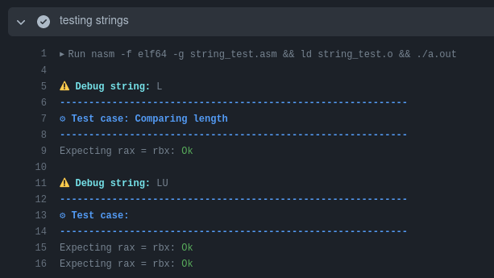
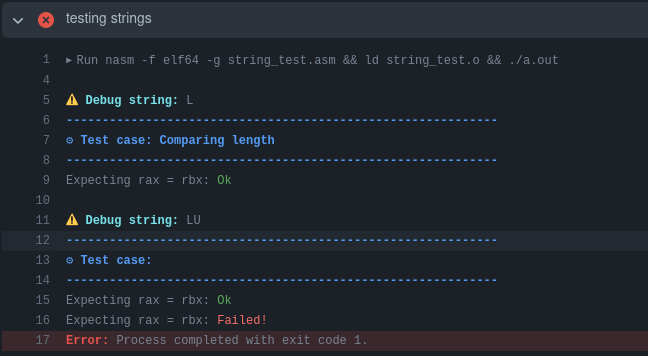

# Assembly study

This is just a repo where I'm commiting some `nasm` code.

# Unit tests

There is not a lot of libs that provide an way of unit testing
assembly code. Since this is a very important subject to me,
I built a lightweight 64 bits library to handle unit tests by
just comparing registers values.

## Tests passing

## Tests failing

